# **Web-SQL注入**

### **类型**

Type: boolean-based blind

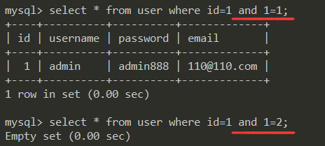

Type: error-based

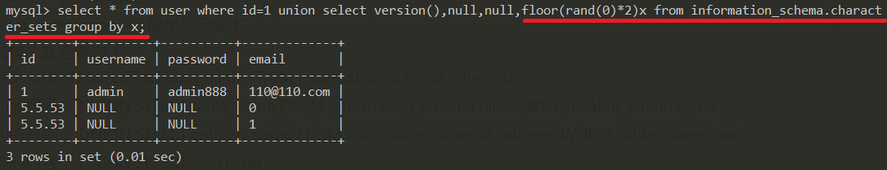

Type: AND/OR time-based blind

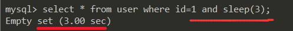

Type: UNION query

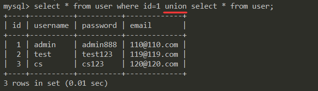

### **Tips**

1. 字段列数不够，报错：`"ERROR 1222 (21000): The used SELECT statements have a different number of columns"`，拿`NULL`来填；

   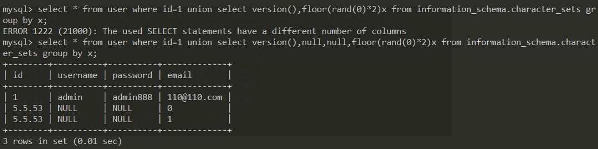

2. `空格`被过滤；

   ```mysql
   使用括号()代替空格，任何可以计算出结果的语句，都可以用括号包围起来；
   select * from(users)where id=1;
   使用注释/**/绕过空格；
   select * from/**/users/**/where id=1;
   ```
   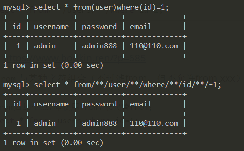

   参考：https://www.bodkin.ren/?p=685

3. 限制`from`与某种字符组合（不过滤from，但不允许from xxx）；

   ```mysql
   在from后加个点.即使用from.来代替from；
   select * from. users where id=1;
   ```
   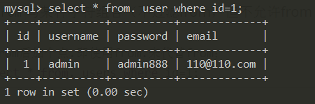

4. `mid`过滤`逗号,`，使用`from x for y`绕过；

   除了`mid`之外，还有`substr`和`left`函数可以指定位置截取字符；

   ```mysql
   mid()，MID(string,start,length)
   substr()，SUBSTR(string, start, length)
   left()，LEFT(string,n)
   ```

   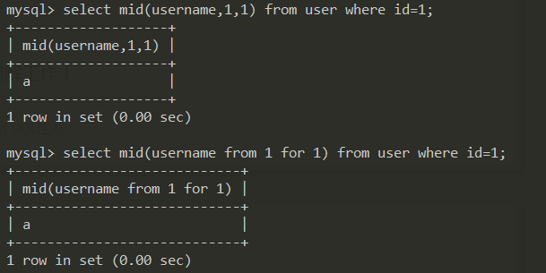

   参考：[http://www.lijiejie.com/mysql-injection-bypass-waf](http://www.lijiejie.com/mysql-injection-bypass-waf)

5. `limit`过滤`逗号,`，使用`offset`绕过；

   ```mysql
   limit x,y ；从第x+1个数据开始取，取y个数据；
   limit x offset y ；从第y+1个数据开始取，去x个数据；
   报错注入有时限制显示字符数，利用第二个来搞即可；
   ```

   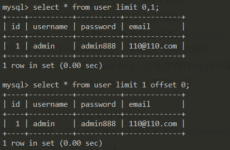

6. 不能使用大小于`大于>小于<`符号，利用greatest()函数绕过；

   ```mysql
   greatest(x,y)，返回x和y中较大的那个数；
   ```

   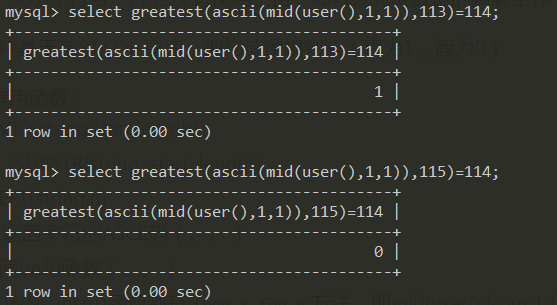

   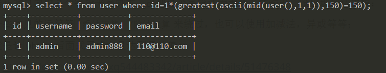

7. 写脚本跑数据：

   ```mysql
   select * from user where id=1/(ascii(mid((select(user()))from(1)for(1)))=114);
   ```

   多是这类语句，既没有出现空格，也没有出现逗号；

   `ascii(mid((select(user()))from(1)for(1)))=114`为真，即为1，`id=1/1=1`，及返回正常页面；

   如果这条语句为假，`id=1/0`，返回错误页面；

   可根据正常页面中某个字段来写脚本，出现这个字段认为为真，并输出，没出现默认丢掉；

   这里注意两点：利用运算符来判断真否时，运算符后的函数要用括号括起来；

   转ascii码可以使用`ascii()`和`ord()`，而这等价；

8. 使用一些常见的运算符`*乘法运算、/除法运算`来绕过，也可以使用加减法，异或等等；

   目的就是让`where`后面式子成立且达到目的值；

   参考：[http://blog.csdn.net/wxq544483342/article/details/51476348](http://blog.csdn.net/wxq544483342/article/details/51476348)

   

9. 表名含特殊字符，无法注出（解决各种乱码问题），使用`Hex编码`等；

   0x61646D696E即为admin的Hex；

   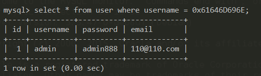

10. 接8，使用`base64`，存在于5.6版本及之后的版本；

   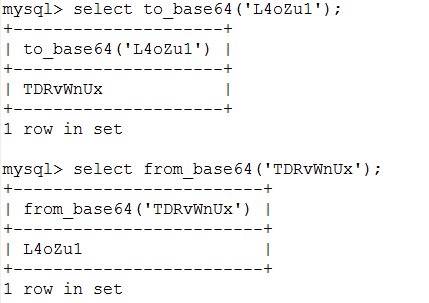

11. 过滤`and和or`，使用`&&和||`绕过；

   目的是让两边条件满足and或or的要求，让其输出数据，多用`or`；  

   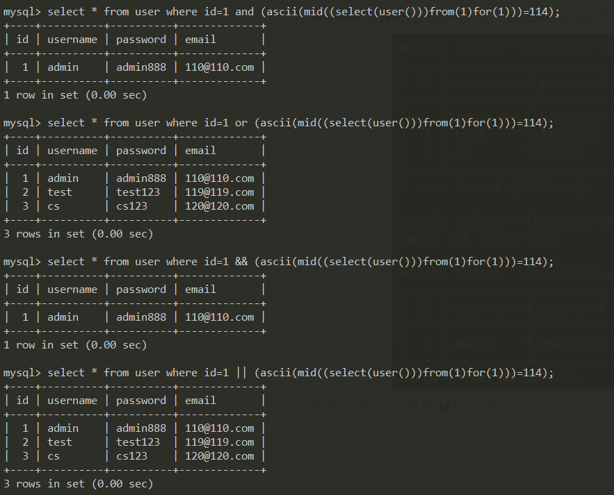

12. `and和or`运算符优先级：首先执行and条件，然后才执行or条件；

    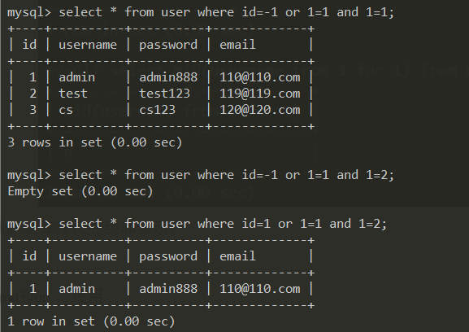

13.  ​